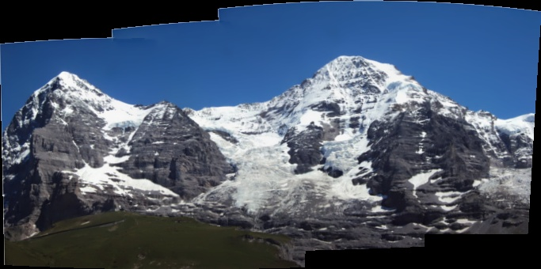
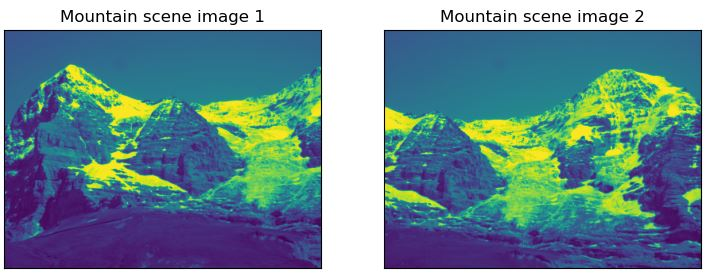
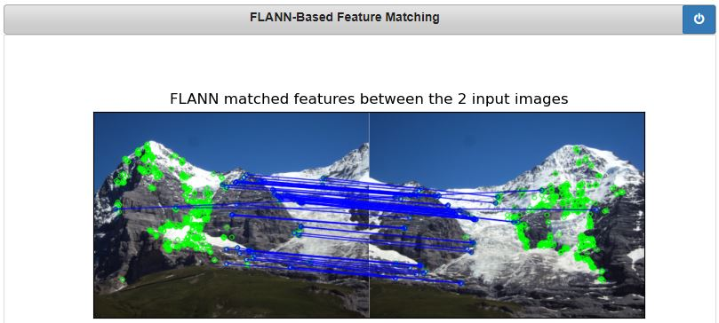
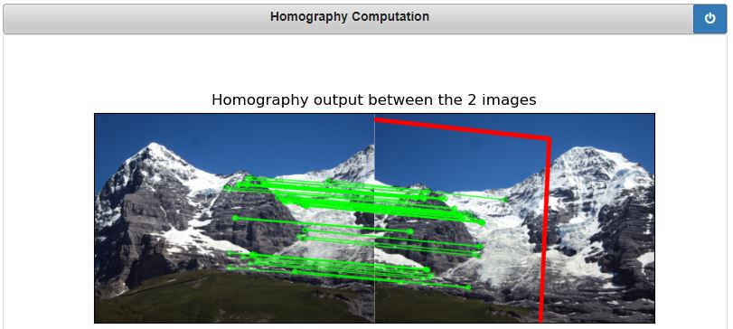

# Image-Stitching-via-Features-Matching-OpenCV-Python

## 1. Objective

To demonstrate image registration and stitching using features detection and matching built-in OpenCV with Python API. 

## 2. Code

## 3. What is Image Stitching?

So what is image stitching ? In simple terms, for an input group of images, the output is a composite image such that it is a culmination of scenes. At the same time, the logical flow between the images must be preserved.

For example, consider the set of images below. From a group of an input montage, we are essentially creating a singular stitched image. One that it covers the full scene in details.

<table>
  <tr>
    <td> Image # 1</td>
    <td> Image # 2</td>
    <td> Image # 3 </td>
   </tr> 
  <tr>
    <td> </td>
    <td> </td>
    <td>  </td>
   </tr> 
</table>

The constructed mountain scene panorama constructed by stitching the above 3 images is as follows.


<table>
  <tr>
    <td> The constructed panorama image</td>
    <td>  </td>
   </tr> 
</table>


## 4. Image Stiching using OpenCV Built-In Stitcher Class

OpenCV has a preconfigured Stitcher configurations to stitch images using different camera models for both C++ and Python APIs. More details about this built-in OpenCV stitching functionaly can be found [**here**](https://docs.opencv.org/master/d8/d19/tutorial_stitcher.html/).  

The built-in OpenCV functinality has many advantages:

* It does not require the input images to be ordered. That is there is no need to specify how images are adjacent to each other from left to right. 
* It allows us to perform high-quality image stitching image quality very efficiently in just a few lines of come as demonstrated in the code below. 
* The image stitching results illustrated in the previous section are generated using the OpenCV Python API stitching functionality.

```python
import time
import cv2
import os
import numpy as np
import sys

def main():
    # read input images
    imgs = []
    path = 'images-set-03/'
    i = 0
    for (root, dirs, files) in os.walk(path):
        images = [f for f in files]
        print(images)
        for i in range(0,len(images)):
            curImg = cv2.imread(path + images[i])
            imgs.append(curImg)

    stitcher = cv2.Stitcher.create(mode= 0)
    status ,result = stitcher.stitch(imgs)
    if status != cv2.Stitcher_OK:
        print("Can't stitch images, error code = %d" % status)
        sys.exit(-1)
    cv2.imwrite("panorama/output-set-03.jpg", result)
    cv2.waitKey(0)


if __name__ == '__main__':
    start = time.time()
    main()
    end = time.time()
    print("Time --->>>>>", end - start)
    cv2.destroyAllWindows()
```

Next, we shall demonstrate how to develop step by step image stitching in order to get a better understanding of the various image processing operations involved in stitching images together.


## 5. Development Simplified Image Stiching 

In this section, we shall demonstrate how to develop step by step image stitching in order to get a better understanding of the various image processing operations involved in stitching images together. We shall us ethe following 2 input images for our illustration.

<table>
  <tr>
    <td> Image # 1</td>
    <td> Image # 2</td>
   </tr> 
  <tr>
    <td> </td>
    <td> </td>
   </tr> 
</table>


The typical image stitching algorithm can be summaried in the following four key steps:

1. Detecting keypoints (DoG, Harris, etc.) and extracting local invariant descriptors (SIFT, SURF, etc.) from two input images
2. Matching the descriptors between the images
3. Using the RANSAC algorithm to estimate a homography matrix using our matched feature vectors
4. Applying a warping transformation using the homography matrix obtained from Step 3.

Next we shall illustrate the steps.

### 5.1. Features Extraction

Idealy, we should use the Scale Invariant Feature Transform (SIFT) descriptor, which is considered to be the best feature extractor and descriptor algorithm. However, thus algorithm has been removed from the  opencv_contrib for the latest version of OpenCV due to licensing requirements. Thus, instead of SIFT, we shall use a reasonably good feature detector and descriptor, known as Oriented FAST and Rotated BRIEF (ORB). 

The next figure illustrated the detected ORB featues overlaid on the 2 input images.

<table>
    <td> </td>
   </tr> 
</table>


### 5.2. Features Matching

Once you have got the descriptors and keypoints of 2 images, i.e. an image pair, we will find correspondences between them. Why do we do this ? Well, in order to join any two images into a bigger images, we must obtain as to what are the overlapping points. These overlapping points will give us an idea of the orientation of the second image w.r.t to the other one. And based on these common points, we get an idea whether the second image has just slid into the bigger image or has it been rotated and then overlapped, or maybe scaled down/up and then fitted. All such information is yielded by establishing correspondences. This process is called registration .

For matching, one can use either FLANN or BFMatcher, that is provided by opencv.
The next figure illustrated the detected ORB featues overlaid on the 2 input images.

<table>
    <td> </td>
   </tr> 
</table>


### 5.3. Compute the Homography

Yes, once we have obtained matches between the images, our next step is to calculate the homography matrix. The homography matrix will use these matching points, to estimate a relative orientation transform within the two images, by solving the following equation:

*Ix=H×Iy*

Estimating the homography is a simple task, which can easliy done using opencv, as demonstraed in the code. The solution homography matrix H of size 3x3, which preserves the straight lines in an image. Hence the only possible transformations possible are translations, affines, etc. For example, for an affine transform,

<table>
    <td> </td>
   </tr> 
</table>


## 6. Conlcusions

