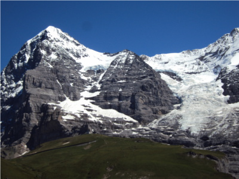
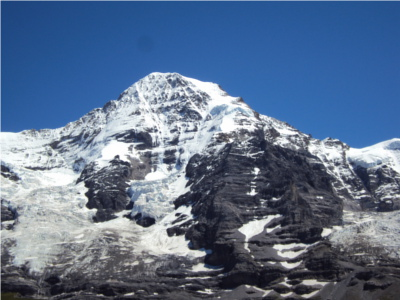

# Image-Stitching-via-Features-Matching-OpenCV-Python

## 1 Objective

To demonstrate image registration and stitching using features detection and matching built-in OpenCV with Python API. 

## 2 Code

## 3 What is Image Stitching?

So what is image stitching ? In simple terms, for an input group of images, the output is a composite image such that it is a culmination of scenes. At the same time, the logical flow between the images must be preserved.

For example, consider the set of images below. From a group of an input montage, we are essentially creating a singular stitched image. One that it covers the full scene in details.

<table>
  <tr>
    <td> Image # 1</td>
    <td> Image # 2</td>
    <td> Image # 3 </td>
   </tr> 
  <tr>
    <td> </td>
    <td> </td>
    <td>  </td>
   </tr> 
</table>

## 4 Image Stiching using OpenCV Built-In Stitcher Class

## 5 Development Simplified Image Stiching 

## 6 Conlcusions

