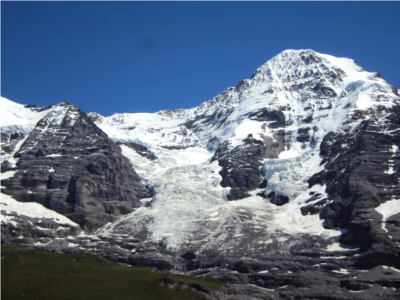

# Image-Stitching-via-Features-Matching-OpenCV-Python

## 1. Objective

To demonstrate image registration and stitching using features detection and matching built-in OpenCV with Python API. 

## 2. Code

## 3. What is Image Stitching?

So what is image stitching ? In simple terms, for an input group of images, the output is a composite image such that it is a culmination of scenes. At the same time, the logical flow between the images must be preserved.

For example, consider the set of images below. From a group of an input montage, we are essentially creating a singular stitched image. One that it covers the full scene in details.

<table>
  <tr>
    <td> Image # 1</td>
    <td> Image # 2</td>
    <td> Image # 3 </td>
   </tr> 
  <tr>
    <td> </td>
    <td> </td>
    <td>  </td>
   </tr> 
</table>

The constructed mountain scene panorama constructed by stitching the above 3 images is as follows.

<table>
  <tr>
    <td> The constructed panorama image</td>
    <td>  </td>
   </tr> 
</table>

## 4. Image Stiching using OpenCV Built-In Stitcher Class

OpenCV has a preconfigured Stitcher configurations to stitch images using different camera models for both C++ and Python APIs. More details about this built-in OpenCV stitching functionaly can be foun  ([here](https://docs.opencv.org/master/d8/d19/tutorial_stitcher.html/)).  

The built-in OpenCv functinality has many advantages:

* It does not require the input images to be ordered. That is there is no need to specify how images are adjacent to each other from left to right. 
* It allows us to perform high-quality image stitching image quality very efficiently in just a few lines of come as demonstrated in our implemented code above. 
* The image stitching results illustrated in the previous section are generated using the OpenCV Python API stitching functionality.

Next, we shall demonstrate how to develop step by step image stitching in order to get a better understanding of the various image processing operations involved in stitching images together.

## 5. Development Simplified Image Stiching 

In this section, we shall demonstrate how to develop step by step image stitching in order to get a better understanding of the various image processing operations involved in stitching images together. We shall us ethe following 2 input images for our illustration.

<table>
  <tr>
    <td> Image # 1</td>
    <td> Image # 2</td>
   </tr> 
  <tr>
    <td> </td>
    <td> </td>
   </tr> 
</table>

The typical image stitching algorithm can be summaried in the following four key steps:

1. Detecting keypoints (DoG, Harris, etc.) and extracting local invariant descriptors (SIFT, SURF, etc.) from two input images
2. Matching the descriptors between the images
3. Using the RANSAC algorithm to estimate a homography matrix using our matched feature vectors
4. Applying a warping transformation using the homography matrix obtained from Step 3.

Next we shall illustrate the steps.

## 6. Conlcusions

